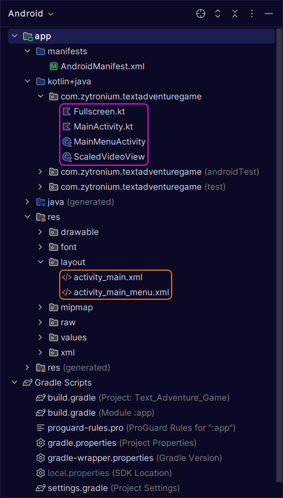

# Mobile App

----
This directory in the repository is for the Android mobile app version of this application.
The mobile app will be able to be downloaded as an installable APK file from Itch.io and/or as a
GitHub release on this GitHub repository. The Android mobile app allows the user to play the text
adventure game on their phone without having to visit a website. This also allows for a better
mobile experience, as web pages are rarely designed to be optimal for mobile users, even if they
are made to be compatible with mobile devices. 

The mobile app uses the Firebase API to pull from the Firebase Firestore database to get the data
containing the story and options for the text adventure game.

#### Tip for viewing source code 
To view mobile app file structure in a more convenient and organized
manner, open the **Mobile_App** directory as an Android Studio project if you
have Android Studio installed; then in the dropdown menu in the top-left
(as seen in the image below), select "`Android`."

The main Kotlin code is in
[kotlin+java/com.zytronium.textadventuregame](Mobile_App/app/src/main/java/com/zytronium/textadventuregame)
and the graphical layout is in [res/layout](app/src/main/res/layout).

