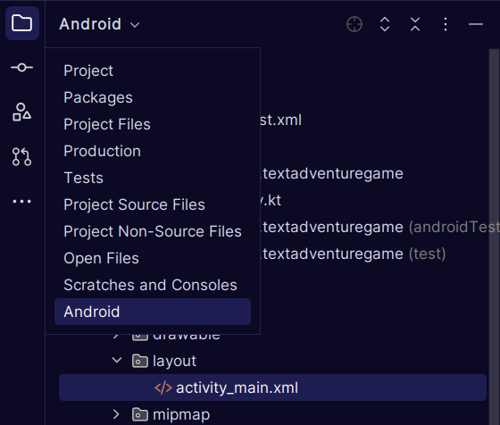
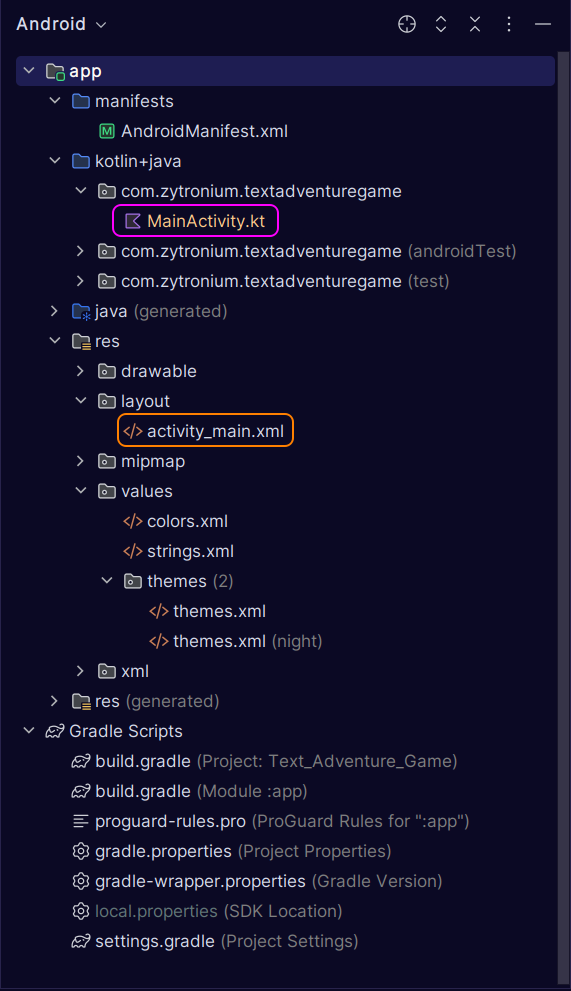

# atlas-hack_sprint_adventure

This is the Hack Sprint for T2 at Atlas School. This Hack Sprint's theme is
"Travel." We are making a text adventure game that works on a website and a
mobile app. Multiplayer voting will be added if there is time.

The webpage front-end and back-end are in [Website](Website) (except for
[index.html](index.html), which has to be at the repo root in order for the
website to work with GitHub Pages), and the mobile app is in [Mobile_App](Mobile_App).  
Tip: to view mobile app file structure in a more convenient and organized
manner, open the **Mobile_App** directory as an Android Studio project if you
have Android Studio installed; then in the dropdown menu in the top-left
(as seen in the image below), select "`Android`."

The main Kotlin code is in
[kotlin+java/com.zytronium.textadventuregame](Mobile_App/app/src/main/java/com/zytronium/textadventuregame)
and the graphical layout is in [res/layout](Mobile_App/app/src/main/res/layout).

